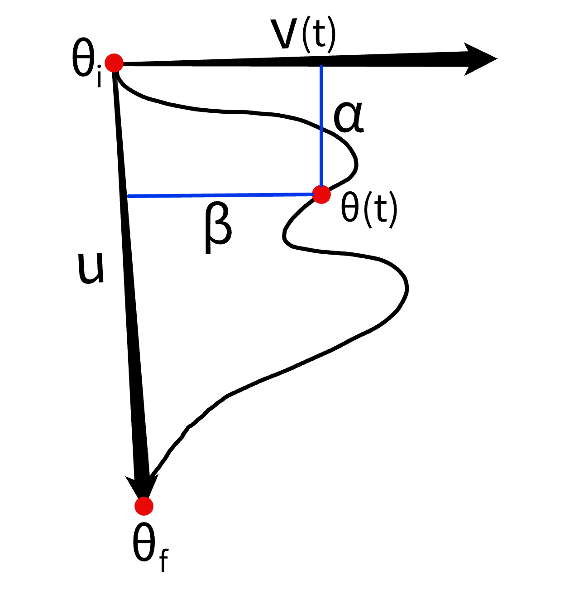
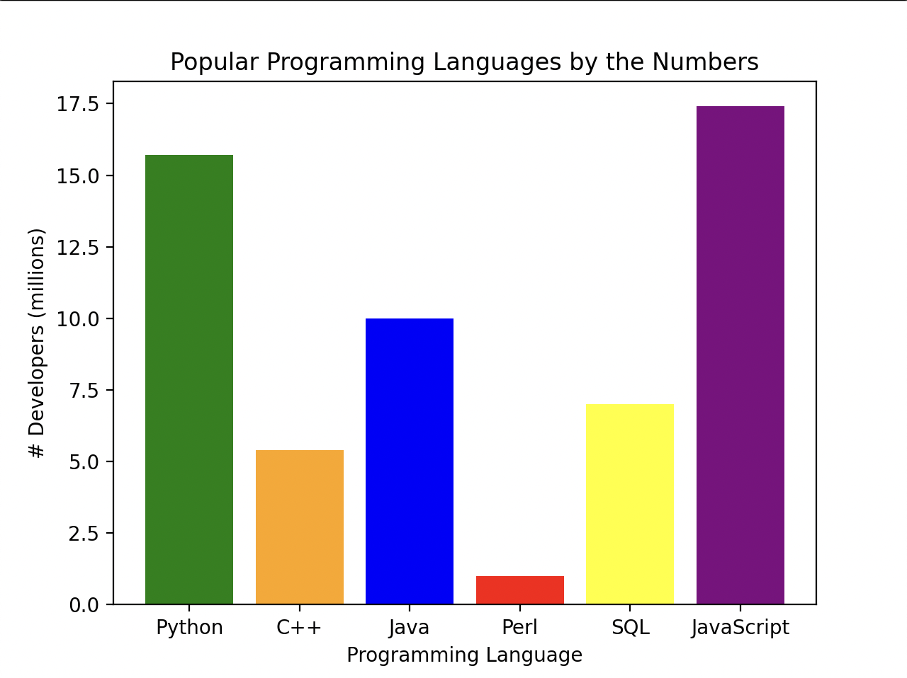
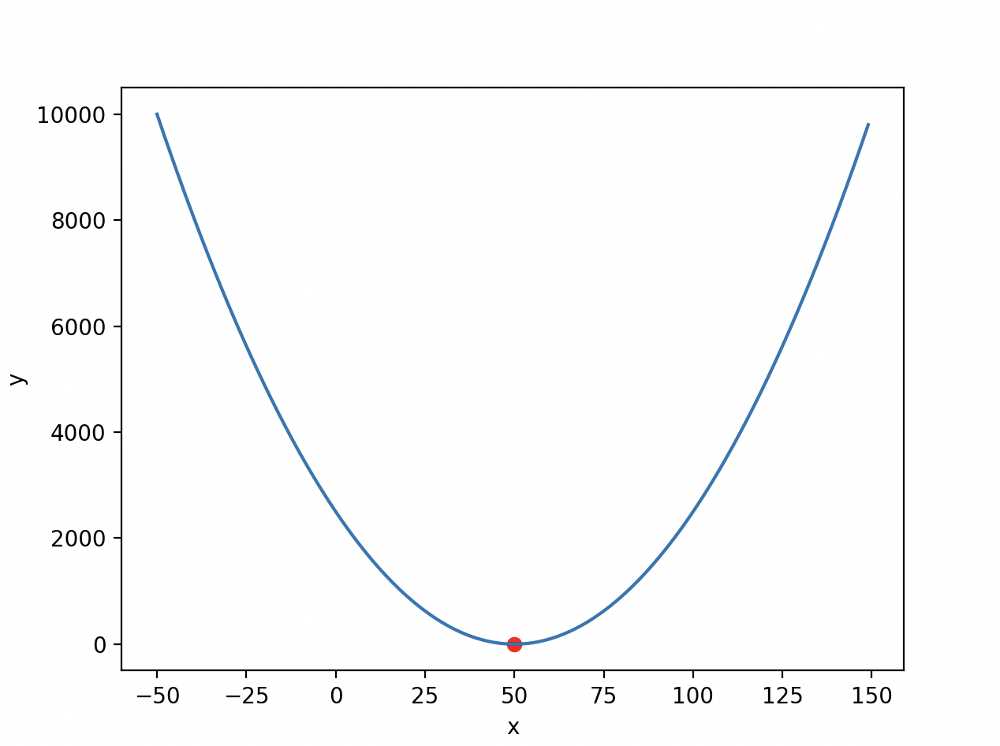
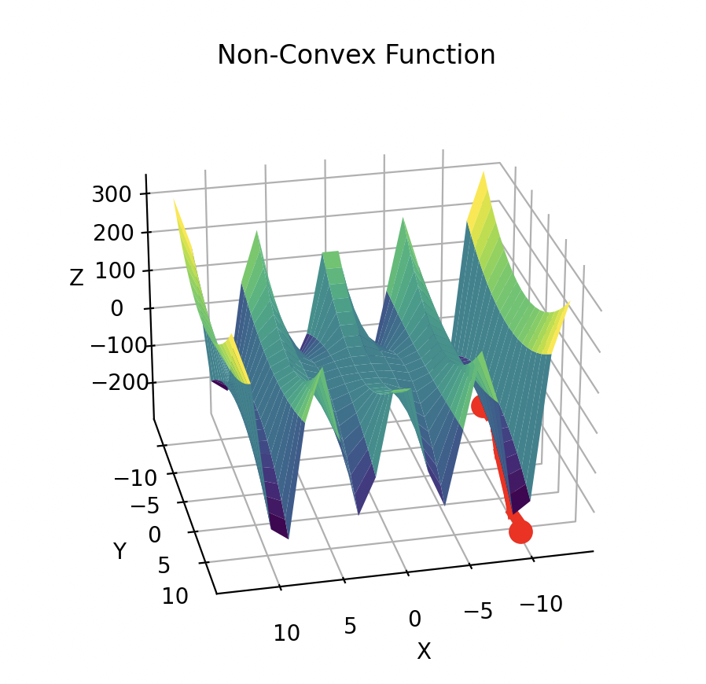
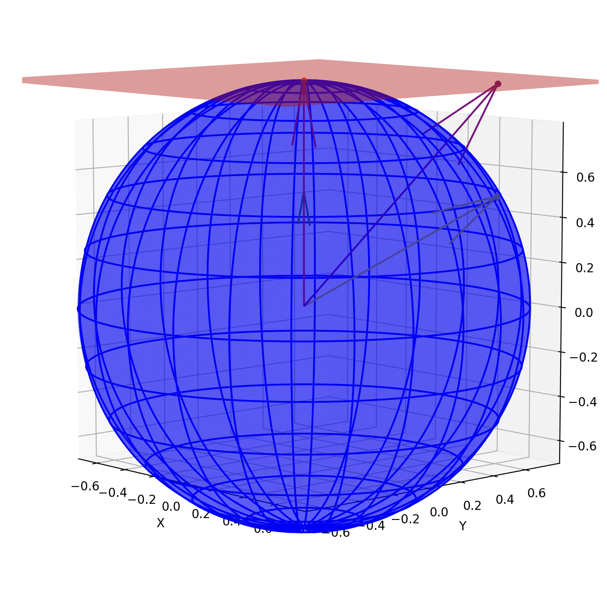
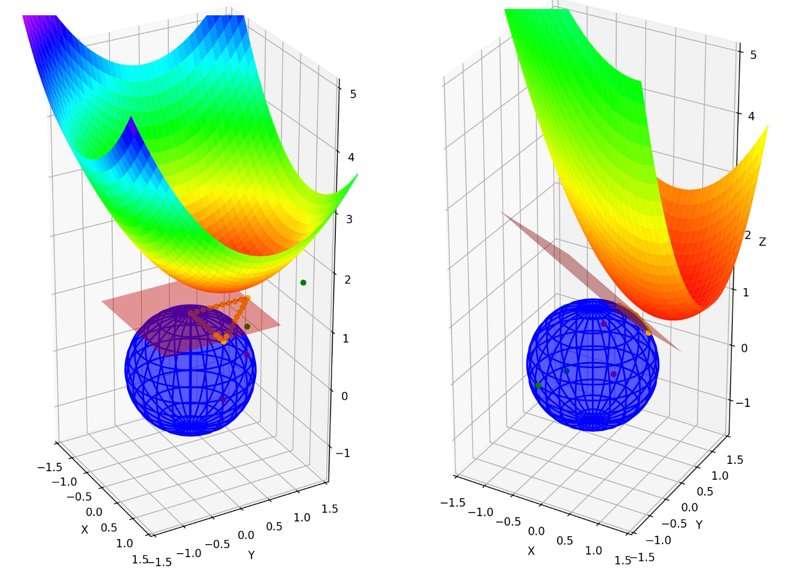
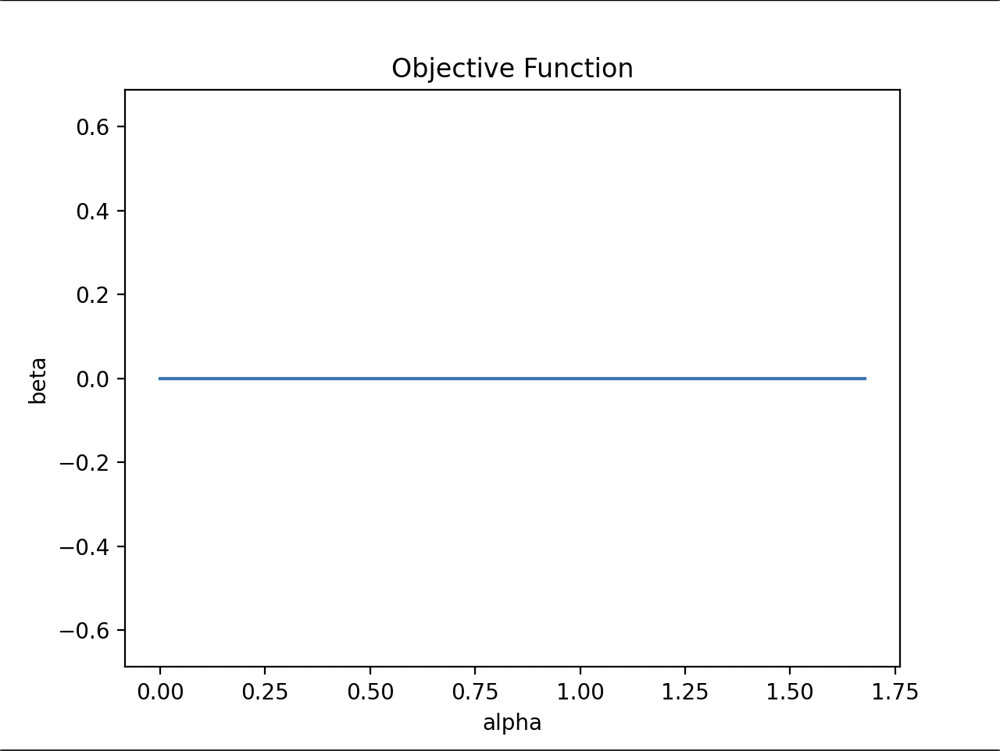
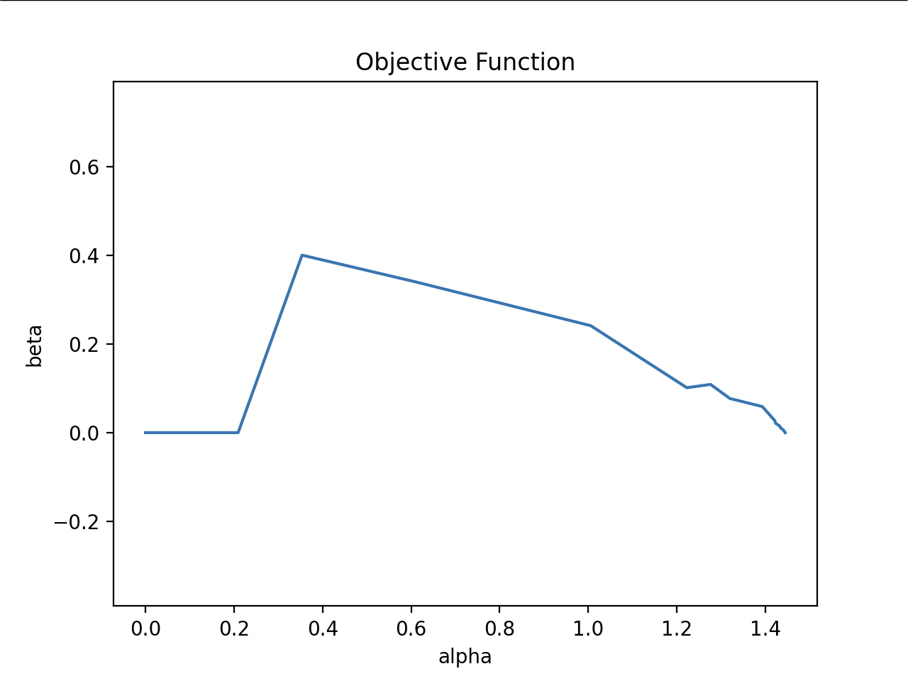

# **Marine Robotics Group Documentation**

## **Introduction**

Our names are Abigail Greenough and Calvin Cigna and the summer before our senior year we interned with the [Marine Robotics Group](https://marinerobotics.mit.edu/). 

This page is intended to function as a summary of our accomplishments over the course of this summer, while also serving as a springboard for future researchers. As you peruse the content, you might find it beneficial to consult our repository on [GitHub](https://github.com/MarineRoboticsGroup/visualizing-slam-optimization-problems). Feel free to explore it for a more in-depth understanding or if you're interested in some light reading.

## **Our Supervisor**

We had the privilege of working under [Alan Papalia](https://alanpapalia.github.io/), a 4th year grad student in the MIT-WHOI joint program. We would not have been able to come as far as we did in these three short months without Alan's support. He encouraged us daily to jump head first into unfamiliar topics, but was always nearby to work through problems or debug code. Alan has truly been a phenomenal supervisor and we owe all of our progress this summer to him.  

## **The Problem**

### **SLAM Robotics**

Simultaneous Localization and Mapping (SLAM) is a problem in robotics where an autonomous vehicle must create a map of an unknown environment while also keeping track of their location in the environment. 

### **SLAM Optimization**

Within the field of SLAM, we are concerned with the optimization problem: reducing the error between pose estimates (where the robot thinks it is/what it thinks the environment looks like) and the ground truth (where the robot actually is/what the environment actually looks like). However, this type of optimization is not simple. Since most, if not all, SLAM optimization problems are non-convex, a minimum that an optimization algorithm reaches is not guaranteed to be the global minimum. In other words, the solution may be a mathematical minimum, but not necessarily the most optimal solution. Additionally, since SLAM optimization problems are highly-dimensional, they are extremely difficult to visualize. It therefore makes it nearly impossible to tell apart the global minimum from other local minima since you cannot see the full picture. 

This is where our work comes in. This summer we began preliminarly work on the visualization of non-convex SLAM optimization problems. Such a tool would aid SLAM roboticists in their optimization of highly-dimensional, non-convex problems.


## **Preliminary Research**

### **Neural Net Optimization**

We began our research by exploring current techniques for visualizing optimization problems in neural nets. 

[Visualizing the Loss Landscape of Neural Nets](https://arxiv.org/pdf/1712.09913.pdf) by Hao Li, Zheng Xu, Gavin Taylor, Christoph Studer, and Tom Goldstein provided insight into potential visualization softwares, such as matplotlib, yet most mathematical techniques were not applicable to SLAM, as aspects of network architecture greatly impact the convexity of neural net optimization problems. For instance, the use of skip connections creates smoother and more generalizable loss landscapes. However, since there is nothing in SLAM that can achieve the same simplifications, the usefulness of this paper is limited. It did, however, provide more insight into the difficulty of visualizing SLAM optimization problems.

The second paper we looked at was [Qualitatively Characterizing Neural Network Optimization Problems](https://arxiv.org/pdf/1412.6544.pdf) by Ian J. Goodfellow, Oriol Vinyals, and Andrew M. Saxe. While this paper also contained many neural-net-specific approaches, we did find a particularly useful/interesting that parameterizes the objective function in terms of $\alpha (t)$, the projection, and $\beta (t)$, the residual.

Before defining $\alpha (t)$ and $\beta (t)$, however, we must first define $\theta (t)$, $\theta _i$, and $\theta _f$. $\theta (t)$ is the stochastic gradient descent (SGD) trajectory at a time ${t}$, $\theta _i$ is the initialization point, and $\theta _f$ is the solution point.

Next, we can define unit vectors ${v} (t)$ and ${u}$.

$$
{v} (t) = \theta (t) - (\theta _i + \alpha (t){u})\\
{u} = \theta _f - \theta _i
$$

Now we are ready to define $\alpha (t)$ and $\beta (t)$.

$$
\alpha (t) = (\theta (t) - \theta _{i} ) ^T u\\
\beta (t) = (\theta (t) - \theta _{i} - \alpha (t) {u}) ^T v
$$

It is also important to note that $\alpha$ and $\beta$ are scalars that are given direction by unit vectors ${u}$ and ${v}$. 

To fully understand how this parameterization works, we first had to get comfortable with some topics in linear algebra.

### **Getting Familiar with Linear Algebra**

The level of traditional linear algebra needed to understand the above equations is low (thankfully!), so we got started with 3Blue1Brown's ["Essence of linear algebra"](https://www.youtube.com/watch?v=fNk_zzaMoSs&list=PLZHQObOWTQDPD3MizzM2xVFitgF8hE_ab) series on YouTube. It focuses on the mathematical meanings of things like vectors, matrices, and determinants, but doesn't go heavily into the computations. [ChatGPT](https://chat.openai.com) can also be super helpful when learning new topics, like linear algebra. 

### **Next Steps**

Once we were able to visualize the above components (see diagram below), we decided to apply this math to SLAM optimization problems. Similarly to how it worked in neural nets, we can use $\alpha (t)$ and $\beta (t)$ to parameterize our objective function in order to visualize the loss landscape in a lower-dimensional space. 

<div style = "text-align: center;">
    
</div>

## **Learning the Tools**

### **Python**

To be able to code up the math from the Goodfellow paper, we first needed to learn Python. We both previously had exposure to C++ and are well-versed in Java, so learning Python was not overly difficult. The [MIT OCW Introduction To Computer Science and Programming in Python](https://ocw.mit.edu/courses/6-0001-introduction-to-computer-science-and-programming-in-python-fall-2016/pages/syllabus/) was helpful and we definitely recommend if you are also interested in learning Python. Other than that, we played around with the assignments for the course and worked on small personal projects (Chess, TicTacToe, etc) until we were comfortable with syntax, structure, and conventions in Python.

For this project we used [VSCode](https://code.visualstudio.com/) as our editor and [Anaconda](https://www.anaconda.com/) to set up our environment. Our repo on GitHub can be found [here](https://github.com/MarineRoboticsGroup/visualizing-slam-optimization-problems). We used version 3.10.12 of Python.

### **Matplotlib**

The next tool we needed was a visualization library. We chose to use [Matplotlib](https://matplotlib.org/) for its simplicity and popularity as well as its integration with [NumPy](https://numpy.org/). We didn't do terribly much to get familiar with either library, as it is easy to learn what you need as you go. 

We did however, make a fun bar graph shown below!

<div style = "text-align: center";>
    
</div>


Either of the terminal commands below work to install Matplotlib.

```python
conda install matplotlib
```

```python
pip install matplotlib
```

Same goes for the commands to install NumPy.

```python
conda install numpy
```

```python
pip install numpy
```

## **SciPy Optimization**

Our next step was to begin visualizing simple optimization problems using [SciPy](https://scipy.org/). Either of the terminal commands below should work for installation.

```python
conda install scipy
```

```python
pip install scipy
```

### **2D Convex**

The first basic problem we practiced with was the optimization of a 2D parabola. This was a good first problem since parabolas are convex and the global minimum is always the same as the vertex.

The code is uninteresting, so we will just show the result below.

<div style="text-align: center;">
    
</div>

It should be no surprise that the red dot at the vertex of the parabola is also the minimum reached by [scipy.optimize.minimize](https://docs.scipy.org/doc/scipy/reference/generated/scipy.optimize.minimize.html).

### **3D Non-Convex**

To ramp up the difficulty, we moved on to visualize a non-convex function with an optimization trajectory in three dimensions. The objective function is defined below.

```python
def non_convex(x):
    return (x[0]**2 + x[1]**2) * np.cos(x[0])
```

The results are shown below. It is important to note that the red line is representative of the optimization trajectory.

<div style = "text-align: center";>
    
</div>

## **Working on Manifolds**

### **SLAM Manifolds**

### **What is a manifold?**

### **Geodesics**

## **Math On Manifolds**
### **Quick Acknowledgements**
The math required for the projections to and retractions from the tangent space is the work of [Nicolas Boumal](https://www.nicolasboumal.net/). Specifically his book, [An Tntroduction to Optimization on Smooth Manifolds](https://www.nicolasboumal.net/#book), was vital to our work. 

### **Tangent Vector Space**

$$
Proj_x : \xi \rightarrow T_x S^{d-1} = \{v \in \xi : <x,v> = 0\}
$$

### **Projections**
In order to project a point from a ${d}$ dimentional manifold into a ${d-1}$ dimentioanl tangent vector space, we needed to remove any similarity that the our given point has with the point difining the tnagent space. To do so, we take the inner product of the point we want to project, ${u}$, and the point that defines the vector space, ${x}$. We multiply it by ${x}$ to have it point in the same direction of the tangent space and then fianlly subtract that from the original point ${u}$. This removes any similarity that ${u}$ shared in the direction with ${x}$, therefore projecting it into the tangent space.

$$
Proj_x : \xi \rightarrow T_x S^{d-1} : u \mapsto Proj_x(u) = u \text{ }- <x,u>x
$$


### **Retractions**


$$
R_x(v) = {{x + v} \over \lVert x + v \rVert} = {{x + v} \over \sqrt {{1 + \lVert v \rVert}^2}}
$$

## **Simple Sphere**

### **Tangent Plane**


### **Projecting Points**
To project points onto the tangent plane, we employed the projection equation outlined in Boumal's work. As detailed in the section on Projections & Retractions, the projection of variable u (in this instance, the point in question) is achieved by subtracting any components that align with the vector defining the tangent plane. This process results in the point being projected onto the tangent plane. 
 

```python
projected_point = (point - np.dot(self.tangent_plane_origin_pt, point) * self.tangent_plane_origin_pt)
```  
<p>&nbsp;</p>
However, when plotted, the projected point would appear within the sphere. This occurs because mathematically, the plane runs through the origin of the sphere. To compensate for this issue and make the point appear to be projected onto the plane tangent to the sphere, we add to the projected point the vector that defines the plane. This adjustment shifts the point outward, creating the illusion that it lies on the surface of the displayed plane.  

```python
return projected_point + self.tangent_plane_origin_pt
```

<p>&nbsp;</p>

<div style ="text-align: center;">

</div>

### **Sampling Points**
While it was easy to sample points in three dimensions, we nevertheless decided to sample using $\alpha$ and $\beta$. This would make scaling the problem into higher dimensions easier later on. In order to sample points, we walked along the trajectory and added additional points by shifting up and down the $\alpha$ and $\beta$ vectors that defined the point we were on. This allowed us to sample points not only on the trajectory but around it as well, allowing us to create a landscape surrounding the trajectory, allowing us to understand the path that the optimizer took.

```python
sampled_point_on_sphere = (
            self.alpha(index) + (shift * sign_alpha_shift))
            * self.u + (self.beta(index) + (shift * sign_beta_shift)) * self.v(index)
            sampled_point_on_plane = self.project_to_tan_plane(sampled_point_on_sphere)
```

### **Creating an Objective Function**
In order to optimize across a surface, there needs to be an objective function that informs the optimizer about how efficient or inefficient certain paths are. Unfortunately, on our 2-dimensional sphere, there was no inherent cost function. To compensate for this, we devised our own using the Karcher mean. The Karcher mean is defined as follows:

$$
{m} = arg min \sum_{i=1}^N d^2 (p, x_i)
$$

* ${m}$ represents the Karcher mean, the point that minimizes the sum of squared distances<br>
* ${p}$ is the reference point.<br>
* ${x_i}$ represents the ${i}$-th point in the set<br>
* ${d^2(p, x_i)}$ represents the squared distance between ${p}$ and ${x_i}$<br>
* The ${arg min}$ notation denotes the argument that minimizes the given expression<br>

The implementation of this in the program is below. It takes only one point at a time and squares the distances between the point we are trying to find the cost of and the three points used to define the optimization trajectory. The sum of these squared distances defines the cost of the function at that point.

```python
temp = (
            (np.linalg.norm(point - pt_origin)) ** 2
            + (np.linalg.norm(point - self.points_on_sphere[1])) ** 2
            + (np.linalg.norm(point - self.points_on_sphere[2])) ** 2
        )
```

### **Plotting the Objective Function**
After failing to visualize the objective function with a surface composed of projected points, we decided to invest some extra effort and visualize it as a surface. We created mesh grids spanning the X and Y coordinates of the sphere, which enabled us to access points and subsequently determine their cost functions. This cost is then assigned to the respective meshgrid containing the Z values for all XY coordinate pairs. These points are then plotted as a single surface, enabling us to visualize the cost as the trajectory moves across the surface of the manifold. 

<div style="text-align: center;">

</div>

## **Higher-Dimensional Sphere**

### **More Complex Data Sets** 

After successfully plotting loss landscapes over 2-dimensional spheres, our next endeavor involved elevating the dimensionality of the sphere. This escalation in dimensionality aimed to amplify the complexity of the problem, rendering it more akin to that of SLAM datasets. Moreover, transitioning to a 7-dimensional sphere eliminated our ability to visually represent the sphere under consideration, thereby necessitating a robust grasp of the mathematical and logical aspects of the problem.

### **Pymanopt**

To make it easier to work on higher-dimensional surfaces, we began to implement additional tools, namely  [Pymanopt](https://pymanopt.org/). Pymanopt is a tool for optimizing on selected manifolds and solving nonlinear problems. It contains functions that allowed us to simplify lots of our code or eliminate parts entirely. Additionally, Pymanopt includes optimizers that allow us to truly optimize on a surface instead of creating our own artificial trajectory. It serves as a useful tool to make our work more efficient and bring us closer to what optimizing SLAM problems would be like.

Either of the terminal commands below work to install Pymanopt.

```python
conda install pymanopt
```

```python
pip install pymanopt
```

### **Convex Objective Function**

The math from [Qualitatively Characterizing Neural Network Optimization Problems](https://arxiv.org/pdf/1412.6544.pdf) by Ian J. Goodfellow, Oriol Vinyals, and Andrew M. Saxe was now necessary to plot the objective function in terms of $\alpha (t)$ and $\beta (t)$. In this initial scenario with the 7-dimensional sphere, the Karcher Mean objective function was entirely convex. It is important to note, however, that even though the objective function is convex in this case, we are still working with a non-convex problem due to the geodesic convexity of the manifold. 

Now we will define geodesic convexity and explain how it differs from traditional Euclidean convexity. This should make sense due to the difference in properties between manifolds and Euclidean spaces. Not surprisingly, geodesic convexity relates to the notion of convexity on Riemannian manifolds. Due to the curvature of these manifolds, convexity cannot be defined in the same way as it is in Euclidean space. A set ${S}$ on a Riemannian manifold is geodesically convex if the geodesic segement connecting any pair of points ${x}$ and ${y}$ in ${S}$, lies entirely in ${S}$. This concept is almost identical to how convexity is defined in Euclidean spaces, except it allows for the curvature of manifolds.

The graphical results are shown below.

<div style="text-align: center;">

</div>

Since the objective function is convex, the optimization trajectory strictly follows the gradients of the loss function to the global minimum. This results in no variation of $\beta (t)$ values and a clearly uninteresting graph. It should be concerning, however, that despite this still being a non-convex problem, the graph above is not an indicator of that. 

### **Non-Convex Objective Function**

Our next step was to introduce non-convexities to the objective function to create a graph more representative of the non-convex nature of nthe After introducing non-convexities to the objective function, the optimization trajectory now has to navigate around obstacles, such as saddle points and local minima. The code that introduced non-convexities is shown below.

```python
    # generates a random matrix to add to karcher mean to try to make it non-convex
    mat_dim = self.manifold.random_point().shape[0]
    rand_mat = np.random.rand(mat_dim, mat_dim)
    rand_psd_mat = rand_mat @ rand_mat.T

    nonconvex_cost = (x.T @ rand_psd_mat @ x)
```

```nonconvex_cost``` is then added to the Karcher mean at a given point to introduce the aforementioned non-convexities. The graphical results are shown below.

<div style="text-align: center;">

</div>
 
It is easy to see that once non-convexities are introduced to an objective function, both optimization and visualization are made much more difficult. This reinforces both the difficulty in our work this summer as well as the value in further developing a visualization tool for SLAM roboticists. 

## **Conclusion**
As we said before, none of this would have been possible with the support of Alan and the rest of Marine Robotics. Despite being high schoolers, we always felt like equals in the lab. For that, we are immensely grateful. If you take anything at all away from this post, let it be that the most amazing things happen when you are out of your comfort zone; so, try something new!

